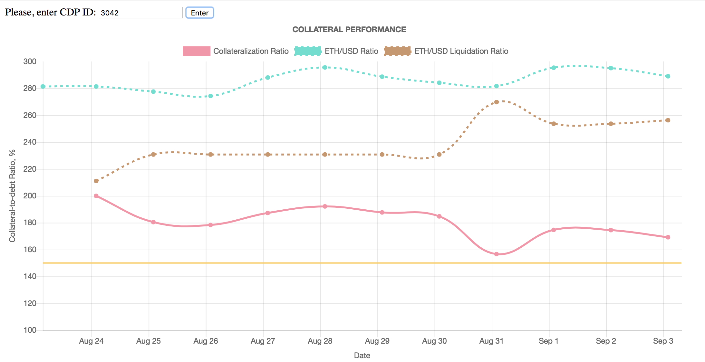

# MakerDAO SuperDashboard
### by 44Finney team

We created a tool that helps Maker DAO’s CDP owners analyze balances and performance of their collateral.



The following charts display:

- Collateralization rates of CDP over time taking into account the following events:
    - Adding collateral to CDP 
    - Wipe
    - Bite
- ETH price at which Bite event occurs, based on the following events:
    - Adding collateral to CDP 
    - Wipe
    - Bite
- Collateral amount and Debt amount over time
- Scattered collateralization

**MakerDAO SuperDashboard is distributed through IPFS**


## Requirements

- Node >= v6.x
- Yarn >= v1.1 | NPM >= v5.0

## Install dependencies

```
$ cd my-app-name
$ yarn
```

## Available tasks

```sh

# Runs development server (Webpack dev server)
$ yarn dev

# Build command
$ yarn build

# Lint with ESLint
$ yarn lint

# Run Flow
$ yarn flow

# Run unit tests (ava + instanbul)
$ yarn test

# Runs http-server on port 8082
$ yarn httpserver

```
